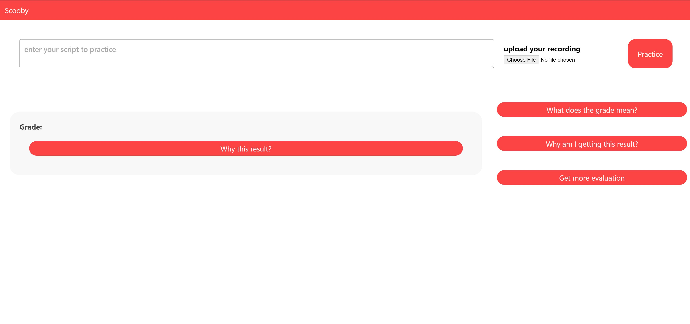

#Scooby
## Milestone 2: Prototype
*SHY* team: *S*hyngys Aitkazinov | *H*yunsung Cho | *Y*ewon Kim

### Project summary
Despite the variety of existing AI pronunciation practicing models, there is no AI-interactive platform for non-native English speakers to evaluate and practice English pronunciation skills with __personalized scripts__ . To solve this problem, we propose Scooby, a AI powered platform where users input their scripts, practice the pronunciation and receive the feedback from AI to further improve the English speech skills. Unique features of Scooby include ii) enabling a user's __personal text input__, ii) visualizing the speech-to-text results with __wrongly spoken parts colored__, iii) providing sophisticated __phonetic-level analysis__ from AI, iv) __scoring the user speeches__.
<!-- , and v) giving users an option to ignore the model. -->

### Instruction
The instructions to set up the project are clearly explained in the README file in our Git repository (we also included README in the submitted zip file).

Our platform usage instructions:

1. This is how the web interface look like: 

2. First step is to type the script in the corresponding box, and then the user should upload his audio for the given script for evaluation. Click `Practice` button. (It takes around 10 seconds to process)
Note, it required to use plain-text for the script and it highly recommended to avoid use special characters such as '_', it might worsen the performance of the platform. The support audio formats are mp3, m4a, wav
Example:

3. Next step is to observe your grade and observe t mistakes the user made, user can ask for the detailed explanation (phoneme-level analysis) by clicking on the button `Why this result?`. The explanation will be done by coloring the parts of the phonemes that the user mispronuonced with red color. Moreover, in order to understand user's mistakes the user might want hear his own and the correct pronounciation synthesized by AI, which could be done by clicking the `Correct Pronounciation` and `My Pronounciation`. Last feature at this point is that the platform shows the text output by the AI how it understood the user's text if there was no script.  

4. By clicking `What does the grade mean?`, the user can  know what does particular grade mean.

5. `Why am I getting this result?` button will provide sophisticated statistics and analysis of the user's speech, so that the user can understand overall pronouncation performance level on the inputted script.

6. Using `Get more evaluation` button, the user can know his/her estimated IELTS and PET scores which will help users to understand their level of pronounciation skills. If the user does not know this evaluation metrics, the corresponding links with description are provided.

### URL of your prototype
http://chris.kaist.ac.kr:5432/

### URL of your Git repository
https://github.com/choch-o/Scooby/

### Libraries and frameworks
For the backend and AI parts we used following libraries and frameworks:
- Django framework
- SpeechAce API (https://docs.speechace.com/ )
- Google Cloud STT and TTS engines:
    - google-api-python-client
    - google-cloud-speech
    - google-cloud-texttospeech
    - some other google libraries
- Audio processing libraries:
    - SoundFile
    - pydub
    - simpleaudio

For the frontend we used:
- ReactJS
- Grommet - for styling UI components
- Axios - REST framework
- React Redux

### Individual Reflections

#### Shyngys Aitkazinov
I have contributed mostly to the AI part, I tested different STT and TTS engines such as Mozilla Deepspeech, Google STT, Google TTS models. From my experiments we decided not to use the  Mozilla Deepspeech because of its poor performance. I integrated google STT and TTS with our platform. I also contributed by processing the raw audio input files to different formats. I wrote the scoring functions for the STT engines, but we did not use them eventually, because of change of main API to SpeechAce.  

I faced difficulties in accessing the APIs from the abovementioned sources. Obtaining credentials was painful for me because of the information validation. Most probably, this is because I am foreigner (I could not validate my info easily). Also, we faced the difficulty of not having enough time to implement everything we wanted.

I learned how to work with audio files, convert to different formats, so that the APIs would accept them. In details, I had to preprocess the imput to fetch it to different AI engines.

#### Hyungsung Cho
I set up the entire system, Django for the backend, React for the frontend (including library setups like Redux and Grommet), and data communication between the back- and frontends. After setting up the skeleton, I implemented the user interface for receiving input of the script and audio file and also passing them to the backend so that other members can easily use them to execute the AI models. Among the explainability features, I contributed to the phenetic analysis using SpeechAce API. I developed the audio playing functions of the user’s audio (My Pronunciation) and Text-To-Speech result audio (Correct Pronunciation) obtained from the backend. 
For the most challenging job, I did the phonetic analysis of the script and the user’s audio. I used the SpeechAce API to obtain the phone score lists for the ground truth script and the user’s audio in the backend. I processed them into a format that would be easy to interpret for users. I designed it so that it is easy for users to compare the parts that they mis-pronounced by highlighting the differences between the phonemes. I implemented the algorithm to find differences between the phone strings and highlight the mispronounced parts.
Through phonetic analysis, I learned that visual highlighting of which parts to pay attention to among the presented information is critical for explainability and interpretability. Before implementing the difference highlights, it was hard to interpret how the pronunciation differed and which parts needed more practice and to be improved. With the addition of color highlights, the difference was more prominent and advanced interpretability. It is one useful design skill that I learned while working on the high-fi prototype. 

#### Yewon Kim
 I mainly contributed in dealing with the SpeechAce API, and implementing some frontend features along with explanations of the given grade. First, I contacted the SpeechAce API team and got an API. Second, I implemented some interactive frontend features, especially the expandable buttons such as “Why this result?”, “What does the grade mean?”, “Why am I getting this result?”, and “Get more evaluation”. Third, using the SpeechAce API, I implemented functions that will request the phonetic-level analysis of user speech, grade, and statistics of the user speech such as estimated IELTS score. 
 The most difficult thing was learning how to connect the frontend and the backend. Since it was my first time using React and Django, I had trouble understanding the basic structure of it; especially passing the request results from the backend to the frontend. Thanks to Hyunsung’s help, I could manage to learn it and implement the code. One difficulty that I faced was getting a SpeechAce API. Since it was the national holiday (Thanksgiving day) in the US and SpeechAce company is located in the United States, the team didn’t reply to my API request, which made the implementation delayed. Luckily, the team responded to the Facebook messages, so I resolved the problem by staying up until 6am and talking to them. The last challenge was implementing user-interactive features; the technical difficulties of developing the frontend made it hard for us to realize all the features that we planned initially. Especially, it was hard for me to sophistically make an “dismiss” or “ignore” button which will make users ignore the analysis. 
 I learned how to pass outputs from backend to frontend using React and Django. To be precise, now I can request an speech analysis to existing APIs (mostly SpeechAce API), process the result, and make the data accessible in the frontend by storing it in a Redux container. Additionally, I learned how to survive while sleeping 3-4 hours a day for 2 weeks. It will be helpful when I pull an all-nighter writing papers in the future. :-)

